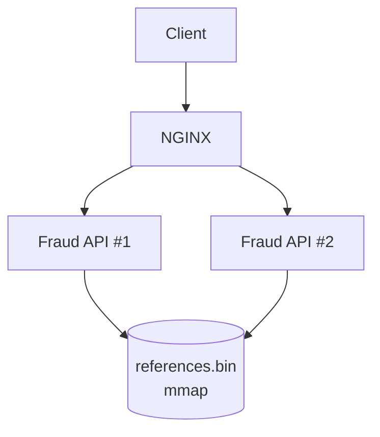
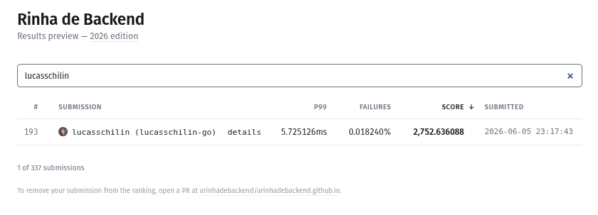
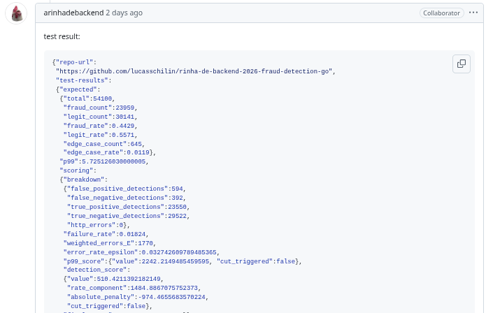

# Rinha de Backend 2026 - Fraud Detection (Go)

My submission for the official Rinha de Backend 2026 challenge.

The goal is to classify transactions as fraud or legitimate using vector similarity search under strict latency, throughput, and resource constraints.

Official challenge repository:

- https://github.com/zanfranceschi/rinha-de-backend-2026

---

## Highlights

- Go
- NGINX load balancer
- 2 API instances
- VP-Tree vector search
- Memory-mapped reference dataset (mmap)
- Preprocessing pipeline converting 3 million vectors into a binary format (`references.bin`)
- Docker Compose deployment
- pprof-driven optimizations

---

## Architecture



### Request Flow

1. Client sends a transaction.
2. NGINX distributes requests across API instances.
3. API performs nearest-neighbor search using a VP-Tree.
4. Reference vectors are read directly from a memory-mapped binary file.
5. Fraud classification is returned.

---

## API

### Health Check

```http
GET /health
```

### Fraud Detection

```http
POST /fraud-check
```

For the complete specification, see the official challenge documentation.

---

## Dataset Loading

The original reference dataset contains approximately 3 million vectors.

During startup, the application loads a preprocessed binary file:

```text
references.bin
```

A preprocessing script converts the original dataset into a compact binary representation, reducing parsing overhead and improving startup performance.

The binary file is accessed using memory mapping (mmap), allowing efficient reads without loading the entire dataset into Go-managed memory.

---

## Optimizations

### Version 1

* Brute-force nearest neighbor search

### Version 2

* Binary preprocessing (`references.bin`)
* mmap dataset loading

### Version 3

* VP-Tree implementation
* Reduced distance calculations
* Lower query latency

### Infrastructure

* NGINX reverse proxy
* Two API instances
* Containerized deployment

---

## Benchmark Result

The official final leaderboard has not been published yet.

My latest official benchmark submission:

{width=250} {width=250}

---

## Running

```bash
docker compose up --build
```

Application will be available through NGINX.

---

## What I Learned

This challenge was a great opportunity to learn and apply:

* Performance profiling with pprof
* Vector similarity search
* VP-Tree indexing
* Memory-mapped files
* Load balancing with NGINX
* Go performance optimization
* Benchmark-driven development